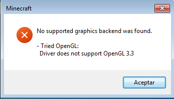

# ForceGL3.0-Remapped

OpenGL 3.0 compatibility for Minecraft **26.1.2** and **26.2**.

> ForceGL3.0-Remapped is an unofficial maintenance fork of **ForceGL3.0** by **coredex-source**.

Minecraft officially requires **OpenGL 3.2**, preventing many older graphics cards from launching the game. This mod forces Minecraft to create an **OpenGL 3.0** context, allowing supported OpenGL 3.0 hardware to run newer Minecraft versions.

Unlike the original project, this fork has been updated for Minecraft **26.1.2** and **26.2**, including updated Mixins, remapped code, rendering compatibility improvements, and an additional compatibility layer required for Minecraft **26.2**.

## Features

- ✅ Supports Minecraft **26.1.2**
- ✅ Supports Minecraft **26.2**
- ✅ Fabric Loader
- ✅ Forces Minecraft to use an **OpenGL 3.0** context
- ✅ Updated Mixins for Minecraft **26.x**
- ✅ Updated rendering compatibility for Minecraft **26.x**
- ✅ Additional compatibility layer for Minecraft **26.2**
- ✅ Remapped to the latest Minecraft mappings
- ✅ Improved compatibility with Intel HD Graphics and similar legacy GPUs

---

## Screenshots

### OpenGL Error (fixed by the mod)

### Hardware Information

---

## What does this mod do?

Since Minecraft 1.17, Mojang officially requires **OpenGL 3.2**.

Many older graphics cards only support **OpenGL 3.0**, causing Minecraft to fail before reaching the main menu.

ForceGL3.0-Remapped modifies the OpenGL context requested during startup, allowing Minecraft to initialize on supported OpenGL 3.0 hardware whenever possible.

This project only addresses the OpenGL version requirement. It is **not** intended to fix broken drivers, missing OpenGL support, or unrelated rendering issues.

---

## Recommended Settings

> **Warning**
>
> OpenGL 3.0 hardware may become unstable when using demanding graphics settings.

For the best experience, it is recommended to:

- Set **Graphics** to **Fast**
- Disable **Clouds**
- Disable **Entity Shadows**
- Use the lowest render distance your hardware can comfortably handle
- Avoid shaders
- Avoid heavy resource packs

These settings greatly improve stability on older GPUs.

---

## Changes from the original ForceGL3.0

This fork includes:

- Port to Minecraft **26.1.2**
- Port to Minecraft **26.2**
- Updated Mixins for Minecraft 26.x
- Updated rendering compatibility
- Additional compatibility layer for Minecraft 26.2
- Updated project mappings
- Various compatibility fixes and maintenance improvements

---

## Tested Hardware

| GPU | OpenGL | Minecraft | Status |
|------|---------|-----------|--------|
| Intel HD Graphics 3000 | 3.0 | 26.1.2 / 26.2 | ✅ Working |

Additional hardware will be added as testing continues.

---

## Bug Reports

If you encounter an issue, please open a GitHub Issue and include:

- Minecraft version
- GPU model
- Operating system
- Fabric Loader version
- Complete **latest.log** or crash report

Bug reports without logs are usually impossible to investigate.

---

## Credits

Original project:

https://github.com/coredex-source/ForceGL3.0

ForceGL3.0-Remapped is an unofficial maintenance fork of ForceGL3.0.

Original implementation by **coredex-source**.

Additional work by **MATYJAGUZ075**:

- Port to Minecraft 26.1.2
- Port to Minecraft 26.2
- Rendering compatibility updates
- Mixins updates
- Compatibility layer improvements
- Ongoing maintenance

---

## Have an older graphics card?

If your GPU only supports **OpenGL 2.0**, use the original **ForceGL2.0** project:

https://github.com/coredex-source/ForceGL2.0-1.2x

---

## License

This project is licensed under the **GNU Lesser General Public License v3.0 (LGPL-3.0)**.

ForceGL3.0-Remapped is a fork of the original ForceGL3.0 project by **coredex-source** and continues to follow the original project's license.

See the `LICENSE` file for the complete license text.
