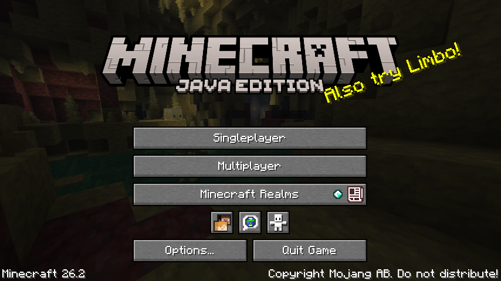
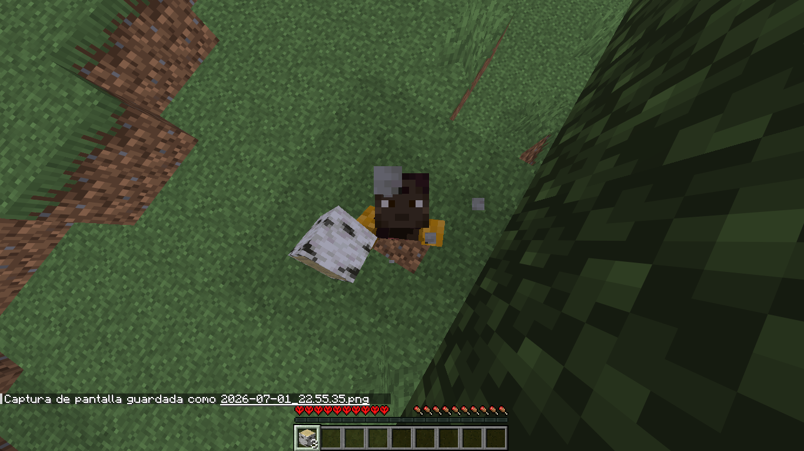
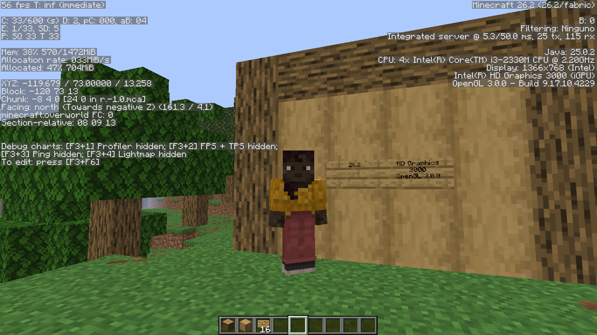

# ForceGL3.0-Remapped

OpenGL 3.0 compatibility for Minecraft 26.1.2 and 26.2

> A remapped and updated version of [ForceGL3.0](https://github.com/coredex-source/ForceGL3.0).

- Supports **Minecraft 26.1.2** and **26.2**.
- Designed for **Fabric**.
- Allows Minecraft to run on **OpenGL 3.0** hardware.
- Original project by **coredex-source**.

---

## Screenshots

### Main Menu



### In-game



### Hardware Information



---

## It doesn't work!

Before opening an issue, please verify that Minecraft is failing with **GLFW error 65542**.

This mod is only intended to solve **GLFW error 65542**, which is caused by Minecraft requiring OpenGL 3.2 on hardware that only supports OpenGL 3.0.

If you receive **any other GLFW error** (for example, **65543** or another number), it is a different problem and is currently **outside the scope of this mod**.

---

## What's New?

Compared to the original ForceGL3.0:

- ✅ Ported to Minecraft **26.1.2**
- ✅ Ported to Minecraft **26.2**
- ✅ Updated to Mojang's new rendering backend
- ✅ Updated Mixins
- ✅ Added OpenGL compatibility fixes
- ✅ Improved compatibility with Intel HD Graphics

---

## Fixes

- Fixes game not launching on OpenGL 3.0 GPUs.
- Fixes several rendering calls introduced in Minecraft 26.x.
- Allows modern Minecraft to run on legacy GPUs that only support OpenGL 3.0.

---

## Why?

Since Minecraft 1.17, Mojang requires **OpenGL 3.2**.

Older GPUs such as:

- Intel HD Graphics 3000
- Intel HD Graphics 2000
- Older AMD GPUs
- Older NVIDIA GPUs

only support **OpenGL 3.0**, preventing Minecraft from starting.

ForceGL3.0-Remapped restores compatibility by forcing an OpenGL 3.0 context and adapting modern rendering calls.

---

## Tested Hardware

| GPU | OpenGL | Minecraft | Status |
|------|---------|-----------|--------|
| Intel HD Graphics 3000 | 3.0 | 26.2 | ✅ Working |

---

## Supported Versions

| Minecraft | Status |
|------------|--------|
| 26.1.2 | ✅ |
| 26.2 | ✅ |
| Newer snapshots | ⚠️ Not guaranteed |

---

## But does it work?

Yes.

This mod has been successfully tested on real OpenGL 3.0 hardware.

However, Minecraft officially requires OpenGL 3.2, so some future Minecraft versions, snapshots, mods or resource packs may not work correctly.

---

## Credits

Original project:

https://github.com/coredex-source/ForceGL3.0

This project is a fork/remap of ForceGL3.0 updated for Minecraft 26.1.2 and 26.2.

Additional work includes:

- Port to Minecraft 26.1.2
- Port to Minecraft 26.2
- Updated rendering compatibility
- Updated Mixins
- OpenGL 3.0 compatibility improvements

All credit for the original implementation goes to **coredex-source**.

---

## Compiling

```bash
./gradlew build
```

The compiled mod will be located in:

```
build/libs/
```

---

## Have an older graphics card?

If your GPU only supports **OpenGL 2.0**, use the original **ForceGL2.0** project instead:

https://github.com/coredex-source/ForceGL2.0-1.2x

---

## License

This project is licensed under the **MIT License**.

See the LICENSE file for details.
